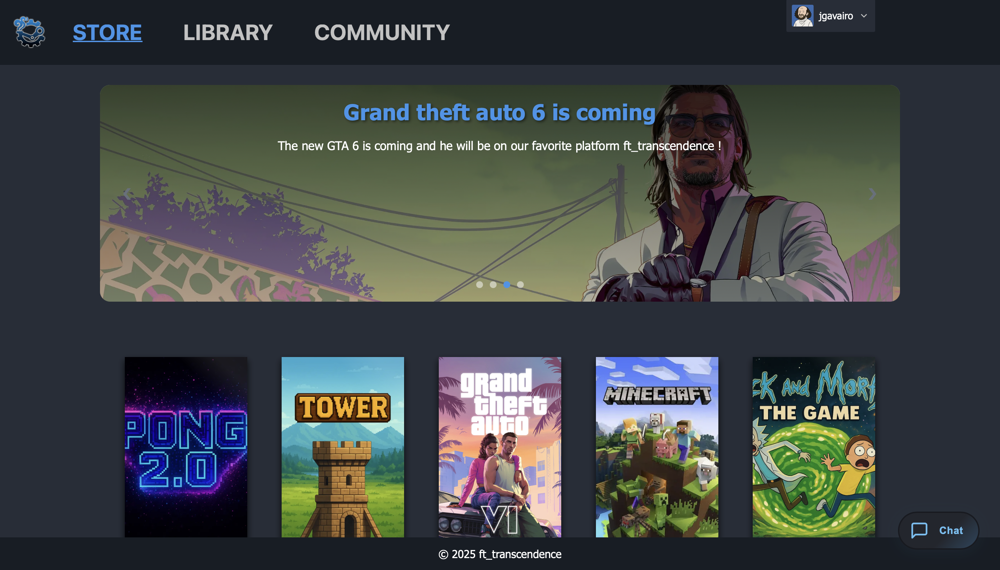

# ft_transcendence

Plateforme web temps-réel mêlant mini‑jeux (Pong, Tower), chat privé, gestion d’amis, classement et profils, avec authentification (Email + Google OAuth2), servie derrière un Nginx en HTTPS.

## Demo
- URL locale: `https://localhost:8443`
- En prod, le reverse proxy redirige vers `https://<hostname>.42lyon.fr:8443`

## Sommaire
Chaque section ci-dessous est cliquable pour accéder directement à la partie.

- [Aperçu](#aperçu)
- [Stack technique](#stack-technique)
- [Architecture](#architecture)
- [Lancer le projet](#lancer-le-projet)
- [Variables d’environnement](#variables-denvironnement)
- [Scripts utiles](#scripts-utiles)
- [Frontend (statique)](#frontend-statique)
- [Backend (Fastify + Socket.IO)](#backend-fastify--socketio)
- [Base de données](#base-de-données)
- [Jeux inclus](#jeux-inclus)
- [Sécurité](#sécurité)
- [Déploiement](#déploiement)
- [FAQ](#faq)
- [Crédits](#crédits)

## Aperçu
- Authentification email/mot de passe + Google OAuth2
- Chat privé en temps-réel (Socket.IO)
- Amis, invitations, blocage, présence en ligne
- Jeux: Pong (matchmaking), Tower (1v1 et solo), classement
- News / Store / Library
- Upload d’avatar, profil, bio
- HTTPS via Nginx (certificats auto-générés en local)


## Stack technique
- Serveur: Fastify 4 + Socket.IO 4, TypeScript
- Auth: JWT en cookie HTTPOnly, Google OAuth2
- DB: SQLite (fichiers persistés via volumes Docker)
- Front: HTML/CSS/JS statique + modules ES (scripts en `scripts/`), Socket.IO client
- Reverse proxy: Nginx (TLS, proxy /api et /socket.io)
- Containerisation: Docker, `docker-compose`
- Outils: TypeScript, Tailwind (deps présentes), sharp/konva (assets), Makefile

## Architecture
- Nginx reverse proxy (HTTPS 8443) → backend Fastify (port 3000, HTTPS interne)
- Static: `public/`, `styles/`, `scripts/`, `assets/` servis par Nginx
- Uploads servis par Fastify via `/uploads/*`
- Namespaces Socket.IO: `/game`, `/chat`, `/notification`, `/tower`
- Routes REST principales: `/api/auth`, `/api/user`, `/api/profile`, `/api/friends`, `/api/chat`, `/api/games`, `/api/news`, `/api/stats`

Schéma (voir `presentation/usecases.html` pour un aperçu visuel et les use‑cases).

## Lancer le projet

Prérequis:
- Docker + Docker Compose
- Make (optionnel mais recommandé)

Démarrage rapide:
```bash
make up
# génère les certifs auto-signés et lance nginx + backend + volumes
```

Arrêt / nettoyage:
```bash
make stop
make down
make clean   # supprime volumes + certifs
make restart # regénère certifs et redémarre
```

Accès:
- `https://localhost:8443` (ignorez l’avertissement de certificat auto‑signé)

## Variables d’environnement
Fichier `.env` (chargé par `docker-compose.yml` pour le service backend):
- `HOSTNAME` (ex: `localhost` ou sous-domaine sans TLD pour 42lyon redirect)
- `JWT_SECRET` (obligatoire)
- `GOOGLE_CLIENT_ID`
- `GOOGLE_CLIENT_SECRET`
- Toute config SMTP si utilisée par nodemailer (si activée)

Note: le backend lit les certificats en `/app/ssl/*.pem` (montés depuis `docker/nginx/ssl`).

## Scripts utiles
- `make up|down|stop|clean|restart`
- Backend (dans `backend/`):
  - `npm run dev` (ts-node `src/server.ts`)
  - `tsc` pour compiler en `dist/` (Dockerfile le fait au build)

## Frontend (statique)
- Entrée: `public/index.html`
- Styles: `styles/*.css`
- Scripts: `scripts/main.ts/js`, pages (`scripts/pages/*`), managers/helpers, jeux (`scripts/games/*`)
- Socket.IO client importé via importmap CDN sur `index.html`
- Les assets sont dans `assets/` (images, sprites, etc.)




## Backend (Fastify + Socket.IO)
- Entrée: `backend/src/server.ts`
- Plugins: `@fastify/cors`, `@fastify/cookie`, `@fastify/multipart`, `@fastify/static`, `@fastify/oauth2`, `fastify-socket.io`
- HTTPS interne: clé/cert en `/app/ssl` (via volume)
- Auth Google: `/api/auth/google` → callback `https://${HOSTNAME}:8443/api/auth/google/callback`
- Sockets:
  - `/chat`: messages privés, broadcast, mappage `userId/username → socketId`
  - `/notification`: enregistrement par `username` pour push événementiels
  - `/game`: matchmaking Pong
  - `/tower`: matchmaking, solo, boucle de jeu serveur, persistance historique et MMR
- Uploads: `@fastify/static` expose `/uploads/` (avatars…)

Routes principales: voir `backend/src/routes/*`.

## Base de données
- SQLite, schéma: `backend/src/database/schema.sql`
  - `users`, `messages`, `games`, `news`, `game_user_rankings`, `match_history`, `game_player`
- Dossier data persisté via volume Docker `ft_transcendence_db`
- Uploads persistés via volume `ft_transcendence_uploads`

## Jeux inclus
- Pong: matchmaking via namespace `/game`, endpoints utilitaires `room-exists`, etc.
- Tower: solo ou 1v1, `GAME_CONFIG.TICK_RATE` pour la fréquence, sauvegarde historique et classements.


## Sécurité
- Cookies HTTPOnly pour JWT (secure en prod)
- CORS permissif en dev (origin: true)
- Nginx force HTTPS (redir 80→8443), websockets proxifiés, SSL self-signed en local
- En prod, prévoir certificats valides et `secure=true`

## Déploiement
- Build via `docker-compose up --build` (ou `make up`)
- Nginx sert `public/`, `styles/`, `scripts/`, `assets/`; reverse proxy `/api` et `/socket.io` vers `backend:3000`
- Envoyer `HOSTNAME` correct et certificats en `docker/nginx/ssl`

## FAQ
- Erreur certificat: auto‑signé en local → accepter l’exception
- Google OAuth2 ne redirige pas: vérifier `HOSTNAME`, client/secret et callback autorisé
- Pas d’images de profil: vérifier volume `uploads_data` et droits

## Crédits
Projet 42 ft_transcendence. Équipe: Gavairon Jordan (jgavairo), Le-Pierres Loic (lle-pier) et Bolea Axel (abolea)

---

# ft_transcendence

Real-time web platform mixing mini-games (Pong, Tower), private chat, friends management, rankings and profiles, with authentication (Email + Google OAuth2), served behind an HTTPS Nginx reverse proxy.

## Demo
- Local URL: `https://localhost:8443`
- In production, the reverse proxy redirects to `https://<hostname>.42lyon.fr:8443`

## Table of Contents
Each section below is clickable to jump directly to it.

- [Overview](#overview)
- [Tech Stack](#tech-stack)
- [Architecture](#architecture-1)
- [Getting Started](#getting-started)
- [Environment Variables](#environment-variables)
- [Useful Scripts](#useful-scripts)
- [Frontend (static)](#frontend-static)
- [Backend (Fastify + Socket.IO)](#backend-fastify--socketio-1)
- [Database](#database)
- [Included Games](#included-games)
- [Security](#security)
- [Deployment](#deployment)
- [FAQ](#faq-1)
- [Credits](#credits-1)

## Overview
- Email/password authentication + Google OAuth2
- Real-time private chat (Socket.IO)
- Friends, invites, block list, online presence
- Games: Pong (matchmaking), Tower (1v1 and solo), rankings
- News / Store / Library
- Avatar upload, profile, bio
- HTTPS via Nginx (self-signed certificates in local dev)


## Tech Stack
- Server: Fastify 4 + Socket.IO 4, TypeScript
- Auth: JWT in HTTPOnly cookie, Google OAuth2
- DB: SQLite (files persisted via Docker volumes)
- Front: static HTML/CSS/JS + ES modules (scripts in `scripts/`), Socket.IO client
- Reverse proxy: Nginx (TLS, proxies /api and /socket.io)
- Containerization: Docker, `docker-compose`
- Tooling: TypeScript, Tailwind (deps present), sharp/konva (assets), Makefile

## Architecture
- Nginx reverse proxy (HTTPS 8443) → Fastify backend (port 3000, internal HTTPS)
- Static assets: `public/`, `styles/`, `scripts/`, `assets/` served by Nginx
- Uploads served by Fastify at `/uploads/*`
- Socket.IO namespaces: `/game`, `/chat`, `/notification`, `/tower`
- Main REST routes: `/api/auth`, `/api/user`, `/api/profile`, `/api/friends`, `/api/chat`, `/api/games`, `/api/news`, `/api/stats`

Diagram note: see `presentation/usecases.html` for a visual architecture and use‑cases.

## Getting Started

Prerequisites:
- Docker + Docker Compose
- Make (optional but recommended)

Quick start:
```bash
make up
# generates self-signed certs and starts nginx + backend + volumes
```

Stop / cleanup:
```bash
make stop
make down
make clean   # remove volumes + certs
make restart # regenerate certs and restart
```

Access:
- `https://localhost:8443` (accept the self‑signed certificate warning)

## Environment Variables
`.env` file (loaded by `docker-compose.yml` for the backend service):
- `HOSTNAME` (e.g., `localhost` or a subdomain without TLD for 42lyon redirect)
- `JWT_SECRET` (required)
- `GOOGLE_CLIENT_ID`
- `GOOGLE_CLIENT_SECRET`
- Any SMTP config if using nodemailer (if enabled)

Note: the backend reads certificates from `/app/ssl/*.pem` (mounted from `docker/nginx/ssl`).

## Useful Scripts
- `make up|down|stop|clean|restart`
- Backend (in `backend/`):
  - `npm run dev` (ts-node `src/server.ts`)
  - `tsc` to compile into `dist/` (Dockerfile does this during build)

## Frontend (static)
- Entry point: `public/index.html`
- Styles: `styles/*.css`
- Scripts: `scripts/main.ts/js`, pages (`scripts/pages/*`), managers/helpers, games (`scripts/games/*`)
- Socket.IO client imported via CDN importmap in `index.html`
- Assets live under `assets/` (images, sprites, etc.)


## Backend (Fastify + Socket.IO)
- Entry: `backend/src/server.ts`
- Plugins: `@fastify/cors`, `@fastify/cookie`, `@fastify/multipart`, `@fastify/static`, `@fastify/oauth2`, `fastify-socket.io`
- Internal HTTPS: key/cert in `/app/ssl` (via volume)
- Google Auth: `/api/auth/google` → callback `https://${HOSTNAME}:8443/api/auth/google/callback`
- Sockets:
  - `/chat`: private messages, broadcast, mapping `userId/username → socketId`
  - `/notification`: register by `username` for event pushes
  - `/game`: Pong matchmaking
  - `/tower`: matchmaking, solo, server game loop, history persistence and rankings
- Uploads: `@fastify/static` exposes `/uploads/` (avatars, ...)

Main routes: see `backend/src/routes/*`.

## Database
- SQLite, schema: `backend/src/database/schema.sql`
  - `users`, `messages`, `games`, `news`, `game_user_rankings`, `match_history`, `game_player`
- Data folder persisted via Docker volume `ft_transcendence_db`
- Uploads persisted via volume `ft_transcendence_uploads`

## Included Games
- Pong: matchmaking via namespace `/game`, utility endpoints like `room-exists`, etc.
- Tower: solo or 1v1, `GAME_CONFIG.TICK_RATE` for server updates, saves history and rankings.


## Security
- HTTPOnly cookies for JWT (secure in production)
- Permissive CORS in dev (origin: true)
- Nginx forces HTTPS (80→8443), websockets proxied, self-signed SSL in local
- In production, use valid certificates and set `secure=true`

## Deployment
- Build with `docker-compose up --build` (or `make up`)
- Nginx serves `public/`, `styles/`, `scripts/`, `assets/`; reverse proxies `/api` and `/socket.io` to `backend:3000`
- Provide correct `HOSTNAME` and certificates under `docker/nginx/ssl`

## FAQ
- Certificate error: self-signed in local → accept the exception
- Google OAuth2 not redirecting: check `HOSTNAME`, client/secret and authorized callback
- Missing profile images: verify `uploads_data` volume and permissions

## Credits
42 ft_transcendence project. Team: Gavairon Jordan (jgavairo), Le-Pierres Loic (lle-pier) and Bolea Axel (abolea)